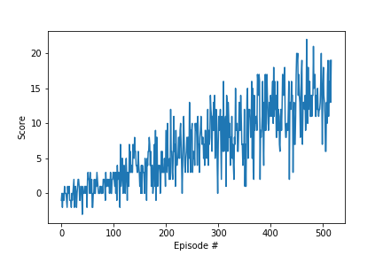

## Table of contents
* [Learning Algorithm](#learning-algorithm)
* [Plot of Rewards](#plot-of-rewards)
* [Ideas for Future Work](#ideas-for-future-work)

## Learning Algorithm
Deep Q-Network algorithm is used to solve this problem. This algorithm works in the given task because of its following advantages

* The use of deep neural network for approximating the Q function allows the agent to learn from complex feature patterns. There are 37 dimensions in the state space and thus good function approximation is necessary to speed up the learning.

* Experience replay and iterative update of separate target and local Q networks are the two important components of DQN algorithm. Experience replay allows agent to learn from a random subset of 64 episodes thereby ensuring that the learning is not biased for the agent. 

* Separating the deep network used to update the Q function (Qnetwork_target) from the deep network used to approximate the Q function (Qnetwork_local) allows us to control the update of hyper parameters for QNetwork_target using the soft_update function. This makes the learning process stable.

The deep network is composed of two fully connected hidden layers with linear transformation. The dimension of both the first and second hidden layers is set to 64. The rectified linear activation function is applied to the output of both hidden layers. The output layer dimension is 4 which corresponds to the size of the action space. 

The hyper parameters chosen for the DQN algorithm are as follows:

* BUFFER_SIZE = int(1e5)  # replay buffer size
* BATCH_SIZE = 64         # minibatch size
* GAMMA = 0.99            # discount factor
* TAU = 1e-3              # for soft update of target parameters
* LR = 5e-4               # learning rate 
* UPDATE_EVERY = 4        # how often to update the network

Some other hyper parameters are as follows:
* n_episodes = 2000       # maximum number of training episodes
* max_t (int) = 1000      # maximum number of timesteps per episode
* eps_start = 1.0         # starting value of epsilon, for epsilon-greedy action selection
* eps_end = 0.01          # minimum value of epsilon
* eps_decay = 0.995       # multiplicative factor (per episode) for decreasing epsilon

## Plot of Rewards
The model was able to solve the task in fewer than 600 episodes

## Ideas for Future Work
We could do the following things to try and speed up the learning:
* Manually change some of the hyper parameters such as the batch_size, update_every
* Modify the number of hidden layers and the dimension of each hidden layer
* Use a grid based search algorithm to find the best set of hyper parameters for this task
